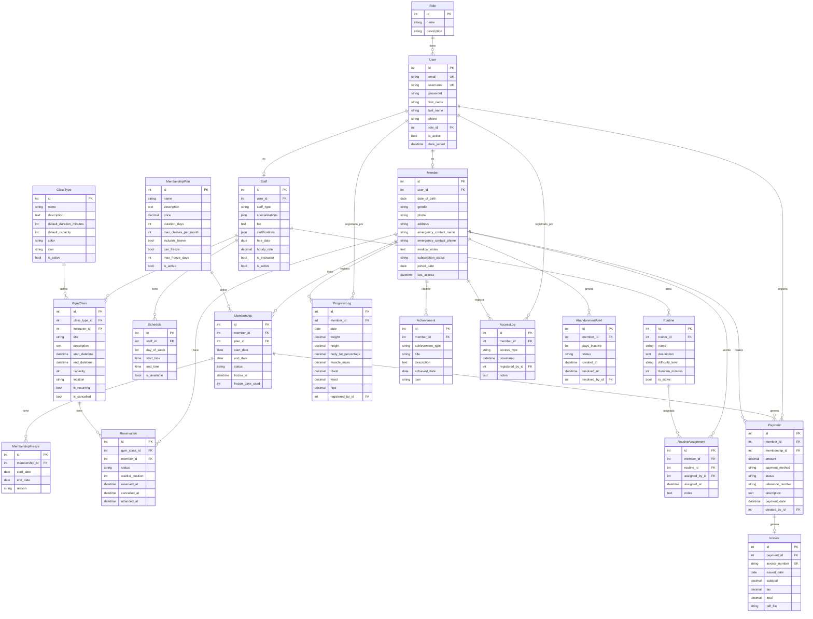
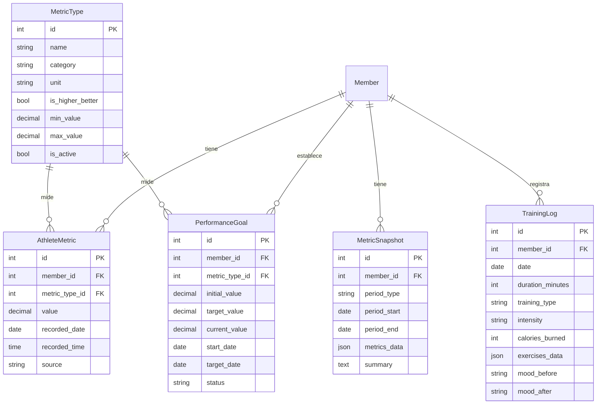
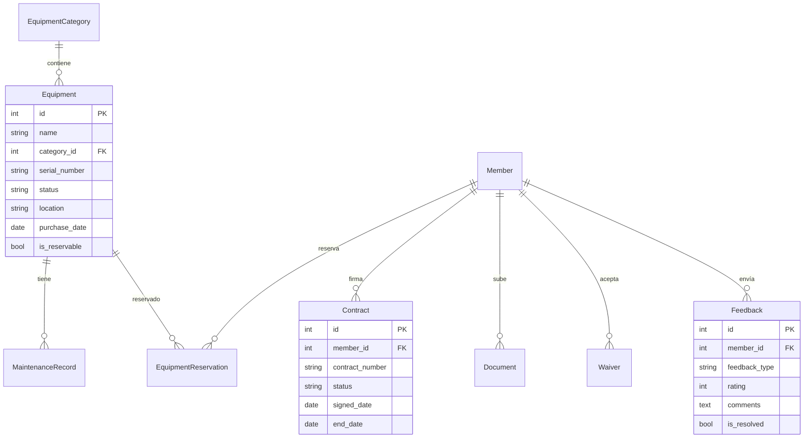

# 🗃️ Diagrama de Entidad-Relación

## Diagrama General del Sistema

## Módulos Adicionales

### Analytics del Atleta

### Equipamiento y Documentos

## Leyenda

| Símbolo | Significado |
|---------|-------------|
| `PK` | Primary Key (Clave primaria) |
| `FK` | Foreign Key (Clave foránea) |
| `UK` | Unique Key (Clave única) |
| `||--o{` | Uno a muchos |
| `||--o|` | Uno a uno |
| `}o--o{` | Muchos a muchos |

## Notas

- Los modelos incluyen campos `created_at` y `updated_at` automáticos
- Las propiedades calculadas (como `days_remaining`, `bmi`) no se muestran en el diagrama
- Los JSONFields almacenan datos estructurados (ejercicios, métricas, etc.)
